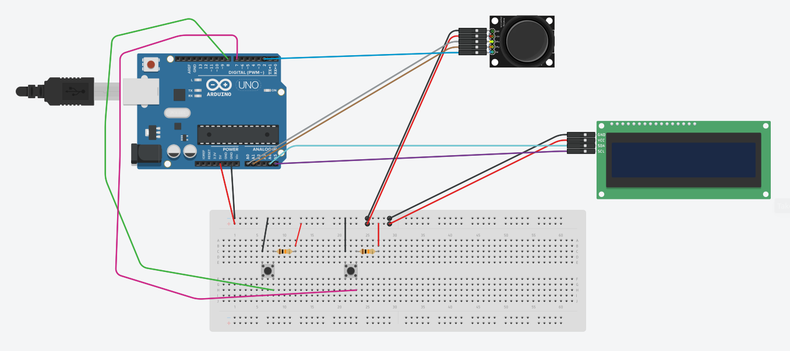

# Killer Boxes

Simple survival game written in C++ for Arduino Uno.

## About

This game was made as a hobby project to test our programming and circuitry skills, and to help us learn a little bit about Arduino PWM interfacing in C/C++.

## Setup

1. Wire up a joystick module, two buttons, and an LCD 1602 module to the arduino board as follows:
    - Joystick Module:
      - GND: Ground
      - +5V: 5 Volts
      - VRx: A0
      - VRy: A1
      - SW: PWM 2
    - Left button: PWM 8
    - Right button: PWM 7
    - 1602 LCD module:
      - GND: Ground
      - VCC: 5 Volt
      - SDA: A4
      - SCL: A5

2. Install [John Rickman's LCD library](https://github.com/johnrickman/LiquidCrystal_I2C) in the Arduino IDE.
3. Open [killer-boxes.ino](killer-boxes.ino) into the IDE, Compile the code and run it on your Arduino!

## Gameplay

- Press the Joystick button to start the game
- Control player movement with the joystick
- Shoot left and right using the aforementioned left and right buttons
- Press joystick button to use "burst" ability (only 3 uses per game)
